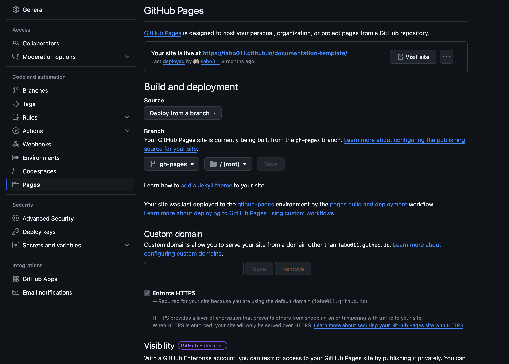

# Website

This website is built using [Docusaurus](https://docusaurus.io/), a modern static website generator.

### Installation

```
$ npm ci
```

### Local Development

```
$ npm run start
```

This command starts a local development server and opens up a browser window. Most changes are reflected live without having to restart the server.

### Build

```
$ npm run build
```

This command generates static content into the `build` directory and can be served using any static contents hosting service.

## Deployment
Make sure you set up Github Pages with the configuration as you can see in the picture below.
Make sure you published the site, when you publish Github Pages, Github will create a random domain
where you can find your documentation. If you have Github Enterprise you can even manage access to Github Pages.



Then, just commit your changes, when you type `git commit -m "message"` husky will execute build and deploy for you, just execute:
```
git add .
```

```
git commit -m "message"
```

```
git push origin main
```

## Demo Documentation on Github Pages
https://fabo011.github.io/documentation-template/