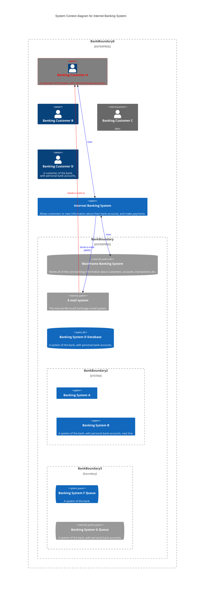

# 3. System Scope and Context

**Contents**

System scope and context - as the name suggests - delimits your system
(i.e. your scope) from all its communication partners (neighboring
systems and users, i.e. the context of your system). It thereby
specifies the external interfaces.

If necessary, differentiate the business context (domain specific inputs
and outputs) from the technical context (channels, protocols, hardware).

https://mermaid.js.org/intro/getting-started.html

:::note 
Write mermaid diagrams directly in md file. The documentation template will automatically compile it.
:::

By the way, how to create annotations? https://docusaurus.io/docs/next/markdown-features/admonitions

**Motivation**

The domain interfaces and technical interfaces to communication partners
are among your system's most critical aspects. Make sure that you
completely understand them.

**Form**

Various options:

-   Context diagrams

-   Lists of communication partners and their interfaces.

See [Context and Scope](https://docs.arc42.org/section-3/) in the arc42
documentation.

---

## Business Context

**Contents**

Specification of **all** communication partners (users, IT-systems, ...)
with explanations of domain specific inputs and outputs or interfaces.
Optionally you can add domain specific formats or communication
protocols.

**Motivation**

All stakeholders should understand which data are exchanged with the
environment of the system.

**Form**

All kinds of diagrams that show the system as a black box and specify
the domain interfaces to communication partners.

Alternatively (or additionally) you can use a table. The title of the
table is the name of your system, the three columns contain the name of
the communication partner, the inputs, and the outputs.

**\<Diagram or Table>**

**\<optionally: Explanation of external domain interfaces>**

---

## Technical Context

**Contents**

Technical interfaces (channels and transmission media) linking your
system to its environment. In addition a mapping of domain specific
input/output to the channels, i.e. an explanation which I/O uses which
channel.

**Motivation**

Many stakeholders make architectural decision based on the technical
interfaces between the system and its context. Especially infrastructure
or hardware designers decide these technical interfaces.

**Form**

E.g. UML deployment diagram describing channels to neighboring systems,
together with a mapping table showing the relationships between channels
and input/output.

**\<Diagram or Table>**

**\<optionally: Explanation of technical interfaces>**

**\<Mapping Input/Output to Channels>**

---

# Solution Strategy

**Contents**

A short summary and explanation of the fundamental decisions and
solution strategies, that shape system architecture. It includes

-   technology decisions

-   decisions about the top-level decomposition of the system, e.g.
    usage of an architectural pattern or design pattern

-   decisions on how to achieve key quality goals

-   relevant organizational decisions, e.g. selecting a development
    process or delegating certain tasks to third parties.

**Motivation**

These decisions form the cornerstones for your architecture. They are
the foundation for many other detailed decisions or implementation
rules.

**Form**

Keep the explanations of such key decisions short.

Motivate what was decided and why it was decided that way, based upon
problem statement, quality goals and key constraints. Refer to details
in the following sections.

See [Solution Strategy](https://docs.arc42.org/section-4/) in the arc42
documentation.