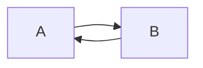
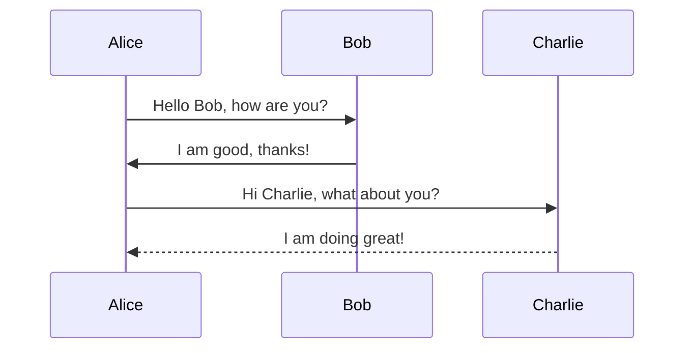
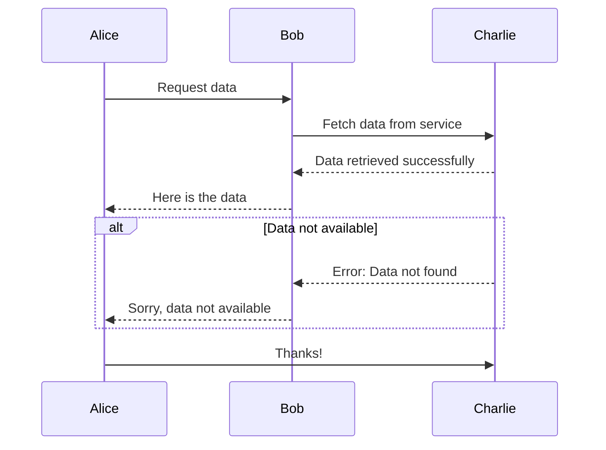
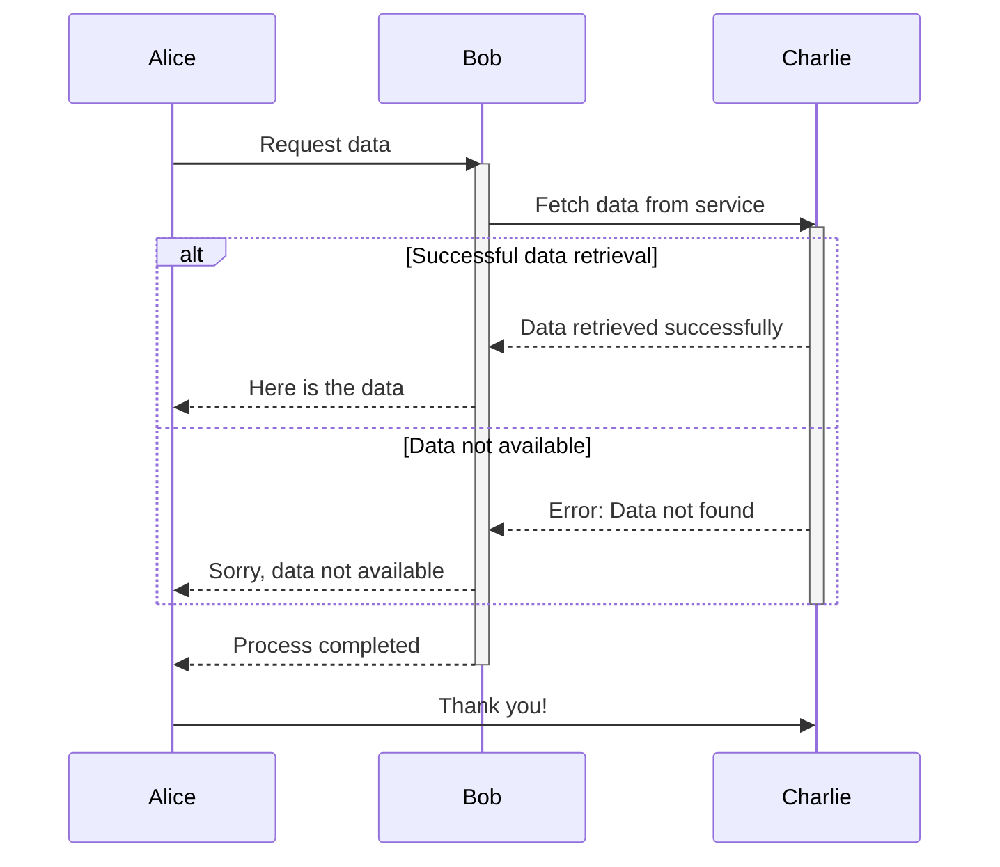
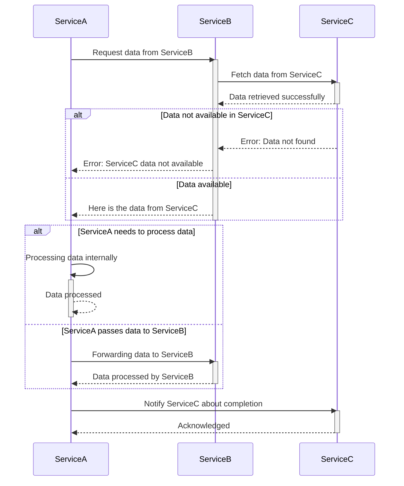

# 6. Runtime View

**Contents**

The runtime view describes concrete behavior and interactions of the
system's building blocks in form of scenarios from the following areas:

-   important use cases or features: how do building blocks execute
    them?

-   interactions at critical external interfaces: how do building blocks
    cooperate with users and neighboring systems?

-   operation and administration: launch, start-up, stop

-   error and exception scenarios

### Diagrams
https://docusaurus.io/docs/next/markdown-features/diagrams

https://mermaid.js.org/intro/getting-started.html

---

---

**Sequence Diagrams**

---

**With Error Handling**

---

**With lifetime bars**

---

**Complex Sequence**

